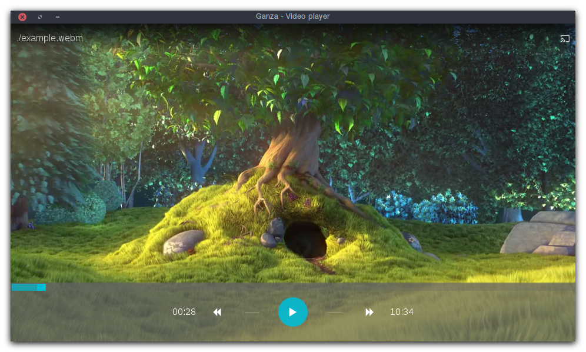
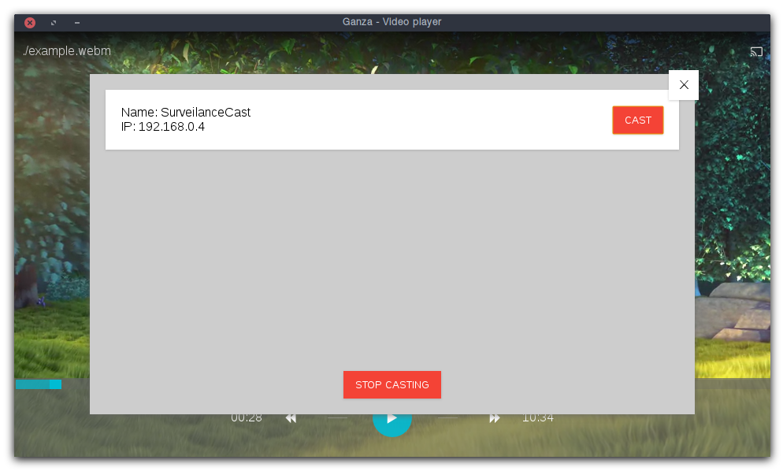

<p align="center">
  <br>
  
  <h1 align="center"> Ganza </h1>
  <p align="center"> Cross platform Video player built with React.js and Electron </p>
  <p align="center"> ChromeCast support included </p>
</p>

## Screenshots




## Usage

```
./ganza video.webm
```

Tested on:
 - [x] Linux
 - [ ] Windows
 - [ ] macos

TODO:
 - [ ] Drag-n-drop video sources
 - [ ] URL sources

## Development

```
$ npm install
$ npm run dev
$ npm start

```

## License [MIT](LICENSE)
